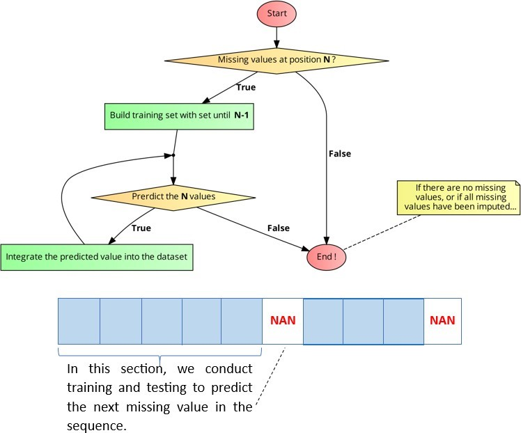

# Topic: Time series imputation using Machine learning and deep learning techniques

# Summary:

Time series imputation refers to the process of filling in missing values in time series data. Imputation of missing values in time series data is critical to ensure data quality and build reliable data-driven predictive models. This is crucial in various fields, especially in healthcare, where accurate and complete datasets are necessary for analysis and decision-making. There are many methods used for performing imputation, but my study during this internship focused on a particular technique, which is the use of machine learning and deep learning techniques for time series imputation. Specifically, I trained models such as SVR, LSTM, and RNN on Blood Glucose Level time series.
For the successful completion of this project, I had access to datasets with varying levels of missing values, ranging from 5% to 50% of missing values. These missing values were randomly generated to properly simulate a real-world situation.
The results of this study showed that the percentage of missing values greatly affects the performance of the trained models.

# Dataset:

The dataset includes blood glucose level (BGL) measurements from 102 patients aged 3 to 17 years who were diagnosed with type 1 diabetes mellitus (T1DM) between 2000 and 2002. Each patient is associated with 6 incomplete datasets. These datasets were produced from the patient's original measurements and contain, respectively, 5%, 10%, 20%, 30%, 40%, and 50% missing data.

# Imputation Algorithm:

The algorithm I used systematically scans the dataset to detect all occurrences of TS-MD (Time Series Missing Data). For each detected Missing Data, a DL/ML model is constructed.
For each missing data, the algorithm selects a window of preceding data points. For example, if the missing value occurs at the 101st position, the algorithm considers the previous 100 blood glucose level (BGL) recordings. This subset of complete data points is used to train a deep learning or machine learning model. The trained model predicts the missing BGL value at the 101st position based on the patterns learned from the previous 100 recordings. The imputed value is then integrated back into the dataset, treating it as if it were a known value.
The algorithm proceeds to the next instance of missing data and repeats the process. For the subsequent missing data, it again considers the most recent complete set of data points, updating the training window accordingly. This iterative process ensures that each missing value is imputed using the most relevant and recent data, continuously refining the model’s accuracy.

